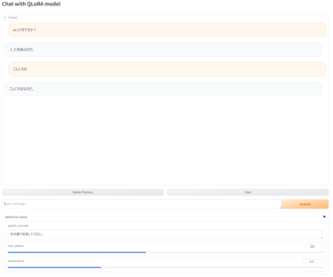
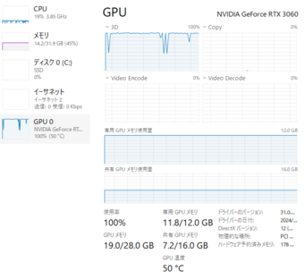
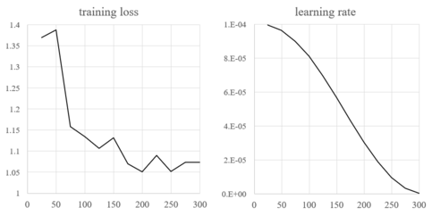

**このリポジトリは、7BのLLMをQLoRAでファインチューニングしたことの記録です。ファインチューニングの実行によって保存されるアダプターモデルのファイル容量が1GBほどあり、リポジトリにアップロードできませんでした。アダプターを用いてテキストチャットを行うためのGradioベースのUIを掲載しておりますので、よろしければご利用ください。**




### QLoRAファインチューニングの記録

1. **環境**：Windows11上でVisual Studio Codeを使用し、次の仕様で実行しました。
   - CPU：Ryzen5 3500
   - メモリー：32GB
   - GPU：GeForce RTX3060 12GB

2. **手順**：QLoRAファインチューニングを行うにあたり、npakaさんが公開してくださった「[Elyza-7BをずんだもんデータセットでQLoRAファインチューニング](https://wandb.ai/npaka3/qlora-zundamon/reports/Elyza-7B-QLoRA---Vmlldzo2MDk3MzYw)」を教科書とし、ソースコードを利用させて頂きました。有益な資料を公開してくださっていることに心よりお礼申し上げます。また、使用したベースモデルは、[elyza/ELYZA-japanese-Llama-2-7b-instruct](https://huggingface.co/elyza/ELYZA-japanese-Llama-2-7b-instruct)であり、データセットは、[takaaki-inada/databricks-dolly-15k-ja-zundamon](https://huggingface.co/datasets/takaaki-inada/databricks-dolly-15k-ja-zundamon)とし、上記資料の通りとしました。

　　QLoRAのソースコードを以下のように一部変更しました：

**重み行列内の個別量子化**：

```python
bnb_config = BitsAndBytesConfig(
    bnb_4bit_use_double_quant=True, 
)
```

**Trainerの設定：メモリー使用量の削減**：npakaさんの記事[大規模モデルを単一GPUで効率的に学習する方法](https://note.com/npaka/n/n04c493394e07)を参考にパラメータ設定し、メモリーオーバーを回避しました。per_device_train_batch_size=4, gradient_accumulation_steps=1 では、実行できませんでした。また、以下の設定でもgradient_checkpointingを有効(True)した場合にエラーが生じました。

```python
training_arguments = TrainingArguments(
    per_device_train_batch_size=1,
    gradient_accumulation_steps=4,
)
```

　下図の通り、終始グラフィックボードのメモリーは100%を使用し、共有メモリも45%が使われた状態でした。




3. **結果**：max_steps=300の実行時間は約4時間でした。ファインチューニングの結果は以下の図の通りでした。




　データセットは15Kのデータが含まれており、1epochの訓練時間は、今回行った実行時間の50倍ほど必要になると思われます(約8日間)。また、elyza/ELYZA-japanese-Llama-2-13b-instructでも試みましたが、当然ながら実行できませんでした。現在の環境では、PCのスペック、自身の能力を含めてですが、ファインチューニングは非常に難しいと感じました。


## テキストチャット用UIについて

1. `main.py`と同じディレクトリに、qlora-modelというフォルダーを配置します。フォルダー内には、QLoRAファインチューニングの実行によって得られる次のファイルを含めます。

　- adapter_config.json：アダプターの構造やハイパーパラメータなどの設定を定義したJSON形式のファイル。
 
　- adapter_model.safetensors：アダプターの重みや他の学習済みパラメータを保存したファイル。

2. `requirements.txt`にリストされている必要な依存関係をインストールします：

```python
pip install -r requirements.txt
```

## UIの実行方法
　ターミナルで次のコマンドを実行します：

```python
gradio main.py
```

　テキストボックスにクエリを入力し、Submitボタンをクリックするとテキストが生成されます。
